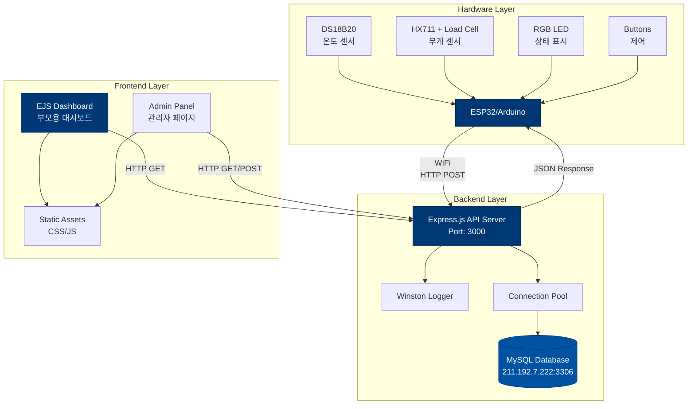
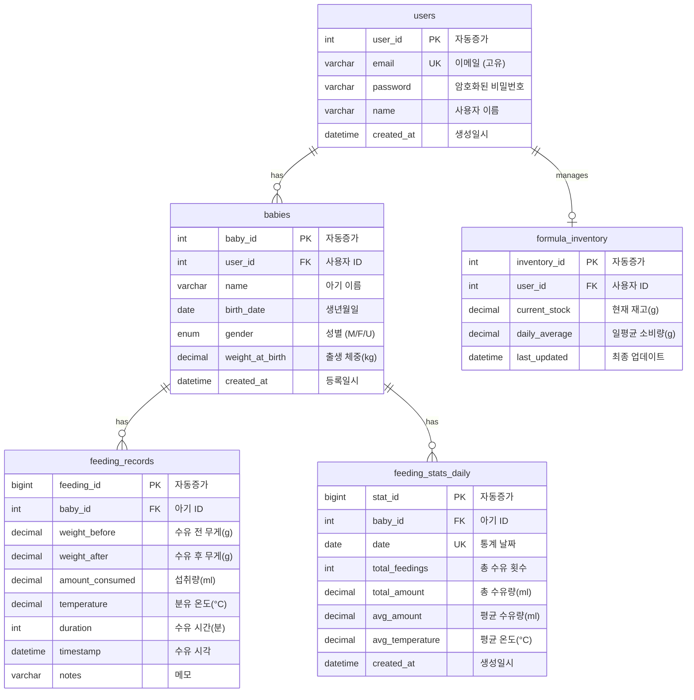
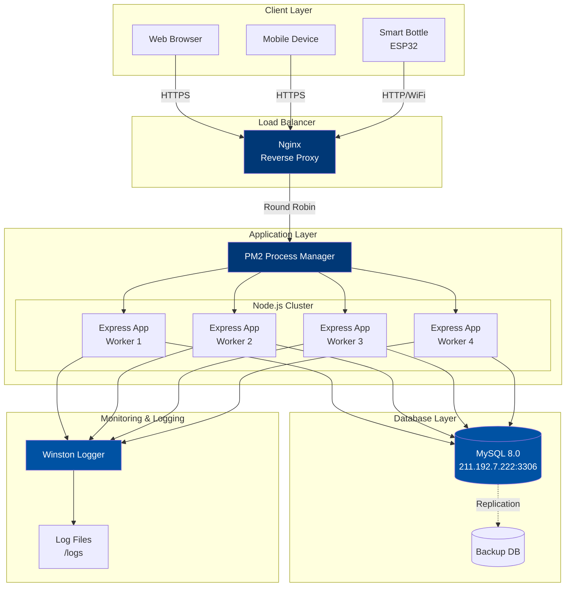

# 🏗️ Smart Bottle IoT - 시스템 아키텍처

> **프로젝트**: 스마트 젖병 모니터링 시스템
> **버전**: v1.1
> **최종 업데이트**: 2025-11-15

---

## 목차
1. [시스템 아키텍처](#1-시스템-아키텍처)
2. [데이터 흐름도](#2-데이터-흐름도)
3. [API 구조](#3-api-구조)
4. [데이터베이스 ERD](#4-데이터베이스-erd)
5. [배포 아키텍처](#5-배포-아키텍처)

---

## 1. 시스템 아키텍처

전체 시스템은 3-Tier 아키텍처로 구성됩니다: Hardware Layer, Backend Layer, Frontend Layer



### 주요 컴포넌트

#### Hardware Layer
- **MCU**: ESP32 또는 Arduino + ESP8266
- **센서**:
  - DS18B20: 디지털 온도 센서 (분유 온도 측정)
  - HX711 + Load Cell: 무게 센서 (수유량 측정)
- **출력**: RGB LED (상태 표시)
- **입력**: 버튼 (제어 인터페이스)

#### Backend Layer
- **Runtime**: Node.js 18+
- **Framework**: Express.js
- **Database**: MySQL 8.0
- **Logging**: Winston
- **Architecture**: MVC Pattern

#### Frontend Layer
- **Template Engine**: EJS
- **Styling**: Custom CSS (Yonsei Blue Design System)
- **JavaScript**: Vanilla JS
- **Layout**: Responsive Design

---

## 2. 데이터 흐름도

센서 데이터가 수집되어 저장되고, 대시보드에 표시되는 전체 흐름

```mermaid
flowchart LR
    subgraph HW["Hardware"]
        S1[온도 센서]
        S2[무게 센서]
        ESP[ESP32]
    end

    subgraph BE["Backend"]
        API[API Server]
        CTRL[Controller]
        SVC[Service]
        MODEL[Model]
        DB[(MySQL)]
    end

    subgraph FE["Frontend"]
        DASH[Dashboard]
        CHART[Charts]
        TABLE[Records Table]
    end

    S1 -->|측정| ESP
    S2 -->|측정| ESP
    ESP -->|POST /api/feedings<br/>{temp, weight, duration}| API

    API --> CTRL
    CTRL --> SVC
    SVC --> MODEL
    MODEL -->|INSERT| DB
    MODEL -->|UPDATE stats| DB

    DB -->|SELECT| MODEL
    MODEL --> SVC
    SVC --> CTRL
    CTRL --> API

    API -->|JSON| DASH
    DASH --> CHART
    DASH --> TABLE

    style ESP fill:#003876,color:#fff
    style API fill:#003876,color:#fff
    style DB fill:#0052A3,color:#fff
    style DASH fill:#003876,color:#fff
```

### 데이터 처리 흐름

1. **센서 측정** (Hardware)
   - 온도 센서: 1초마다 측정
   - 무게 센서: 연속 모니터링
   - ESP32: 데이터 수집 및 전처리

2. **데이터 전송** (Hardware → Backend)
   - WiFi 통신
   - HTTP POST /api/feedings
   - JSON 형식

3. **데이터 저장** (Backend)
   - 수유 기록 저장 (feeding_records)
   - 일별 통계 업데이트 (feeding_stats_daily)
   - 분유 재고 업데이트 (formula_inventory)

4. **데이터 조회** (Backend → Frontend)
   - RESTful API
   - 통계 계산
   - JSON 응답

5. **데이터 시각화** (Frontend)
   - 실시간 수유 상태
   - 차트 및 그래프
   - 수유 기록 테이블

---

## 3. API 구조

RESTful API 엔드포인트 구조 및 관계

```mermaid
graph TD
    ROOT[/api]

    subgraph "수유 기록 API"
        FEED[/feedings]
        FEED_POST[POST /feedings<br/>새 수유 기록]
        FEED_GET[GET /feedings<br/>전체 기록 조회]
        FEED_LATEST[GET /feedings/latest<br/>최근 10개]
        FEED_CURRENT[GET /feedings/current<br/>진행 중인 수유]
        FEED_ID[GET/PUT/DELETE /feedings/:id<br/>특정 기록 조회/수정/삭제]
    end

    subgraph "통계 API"
        STATS[/stats]
        STATS_TODAY[GET /stats/today<br/>오늘 통계]
        STATS_DAILY[GET /stats/daily<br/>일별 통계]
        STATS_WEEKLY[GET /stats/weekly<br/>주별 통계]
        STATS_MONTHLY[GET /stats/monthly<br/>월별 통계]
        STATS_COMPARE[GET /stats/compare<br/>또래 비교]
    end

    subgraph "아기 관리 API"
        BABY[/babies]
        BABY_POST[POST /babies<br/>아기 등록]
        BABY_GET[GET /babies<br/>아기 목록]
        BABY_ID[GET/PUT/DELETE /babies/:id<br/>아기 정보 조회/수정/삭제]
    end

    subgraph "분유 재고 API"
        FORMULA[/formula]
        FORMULA_STOCK[POST/GET /formula/stock<br/>재고 업데이트/조회]
        FORMULA_PRED[GET /formula/prediction<br/>소진 예측]
    end

    subgraph "인증 API"
        AUTH[/auth]
        AUTH_REG[POST /auth/register<br/>회원가입]
        AUTH_LOGIN[POST /auth/login<br/>로그인]
        AUTH_LOGOUT[POST /auth/logout<br/>로그아웃]
    end

    subgraph "사용자 API"
        USER[/users]
        USER_PROFILE[GET/PUT /users/profile<br/>프로필 조회/수정]
    end

    ROOT --> FEED
    ROOT --> STATS
    ROOT --> BABY
    ROOT --> FORMULA
    ROOT --> AUTH
    ROOT --> USER

    FEED --> FEED_POST
    FEED --> FEED_GET
    FEED --> FEED_LATEST
    FEED --> FEED_CURRENT
    FEED --> FEED_ID

    STATS --> STATS_TODAY
    STATS --> STATS_DAILY
    STATS --> STATS_WEEKLY
    STATS --> STATS_MONTHLY
    STATS --> STATS_COMPARE

    BABY --> BABY_POST
    BABY --> BABY_GET
    BABY --> BABY_ID

    FORMULA --> FORMULA_STOCK
    FORMULA --> FORMULA_PRED

    AUTH --> AUTH_REG
    AUTH --> AUTH_LOGIN
    AUTH --> AUTH_LOGOUT

    USER --> USER_PROFILE

    style ROOT fill:#003876,color:#fff
    style FEED fill:#0052A3,color:#fff
    style STATS fill:#0052A3,color:#fff
    style BABY fill:#0052A3,color:#fff
    style FORMULA fill:#0052A3,color:#fff
    style AUTH fill:#0052A3,color:#fff
    style USER fill:#0052A3,color:#fff
```

### API 응답 형식

모든 API는 통일된 응답 형식을 사용합니다:

```json
{
  "success": true,
  "data": {},
  "message": "성공 메시지",
  "error": null
}
```

---

## 4. 데이터베이스 ERD

MySQL 데이터베이스 테이블 관계도



### 테이블 설명

#### users (사용자)
- 시스템 사용자 정보
- 이메일 기반 인증
- bcrypt 암호화

#### babies (아기 정보)
- 사용자별 아기 정보 관리
- 생후 일수 계산 기준
- 성장 추적

#### feeding_records (수유 기록)
- 모든 수유 이벤트 기록
- 센서 데이터 저장
- 시계열 데이터

#### formula_inventory (분유 재고)
- 사용자별 분유 재고 관리
- 소비량 추적
- 예측 알고리즘 기반

#### feeding_stats_daily (일별 통계)
- 일별 집계 데이터
- 성능 최적화용
- 대시보드 조회 성능 향상

---

## 5. 배포 아키텍처

운영 환경 인프라 구조



### 배포 환경 구성

#### Application Server
```yaml
서버 구성:
  - PM2 클러스터 모드 (4 workers)
  - Node.js 18+ LTS
  - Express.js 애플리케이션
  - CPU 코어당 1 워커 프로세스

프로세스 관리:
  - PM2 자동 재시작
  - 무중단 배포 (reload)
  - 로그 로테이션
  - 성능 모니터링
```

#### Database Server
```yaml
MySQL 8.0:
  - Host: 211.192.7.222
  - Port: 3306
  - Database: smart_bottle
  - User: rudwo

Connection Pool:
  - 최소 연결: 5
  - 최대 연결: 20
  - Timeout: 60초

백업 전략:
  - 일일 풀 백업
  - 트랜잭션 로그 백업
  - 복제 (Replication)
```

#### Reverse Proxy (Nginx)
```yaml
기능:
  - HTTPS 종료
  - 로드 밸런싱
  - 정적 파일 서빙
  - Gzip 압축
  - Rate Limiting

로드 밸런싱:
  - 알고리즘: Round Robin
  - 헬스 체크: /api/health
  - Timeout: 30초
```

#### Logging & Monitoring
```yaml
Winston Logger:
  - 레벨: error, warn, info, debug
  - 파일 로테이션: 일별
  - 보관 기간: 30일

로그 파일:
  - /logs/error.log
  - /logs/combined.log
  - /logs/access.log
```

### 보안 구성

```yaml
네트워크 보안:
  - HTTPS/TLS 1.3
  - 방화벽 설정
  - IP 화이트리스트 (Admin)

애플리케이션 보안:
  - JWT 토큰 인증
  - bcrypt 비밀번호 암호화
  - SQL Injection 방지 (Prepared Statement)
  - XSS 방지
  - CORS 설정

데이터베이스 보안:
  - 암호화된 연결
  - 최소 권한 원칙
  - 감사 로그
```

### 성능 최적화

```yaml
캐싱 전략:
  - 연결 풀링
  - 쿼리 결과 캐싱 (예정)
  - 정적 파일 CDN (예정)

인덱스 최적화:
  - feeding_records(baby_id, timestamp)
  - users(email)
  - feeding_stats_daily(baby_id, date)

쿼리 최적화:
  - Prepared Statement
  - 배치 처리
  - 페이지네이션
```

---

## 기술 스택 요약

### Backend
- **Runtime**: Node.js 18+
- **Framework**: Express.js 4.16+
- **Database**: MySQL 8.0
- **Logger**: Winston 3.8+
- **Process Manager**: PM2

### Frontend
- **Template Engine**: EJS 3.1+
- **CSS**: Custom CSS (Yonsei Blue Design System)
- **JavaScript**: Vanilla ES6+
- **Design System**: 8px spacing, Typography scale

### Hardware
- **MCU**: ESP32 / Arduino + ESP8266
- **Communication**: WiFi (HTTP)
- **Sensors**: DS18B20, HX711 + Load Cell
- **Output**: RGB LED
- **Input**: Push Buttons

### DevOps
- **Version Control**: Git
- **Process Manager**: PM2 Cluster Mode
- **Reverse Proxy**: Nginx (예정)
- **Monitoring**: Winston Logging

---

## 참조
- [CLAUDE.md](../CLAUDE.md) - 프로젝트 가이드
- [package.json](../package.json) - 의존성 관리
- [service.config.js](../service.config.js) - PM2 설정

---

**최종 업데이트**: 2025-11-15
**작성자**: Claude AI
**버전**: v1.0
